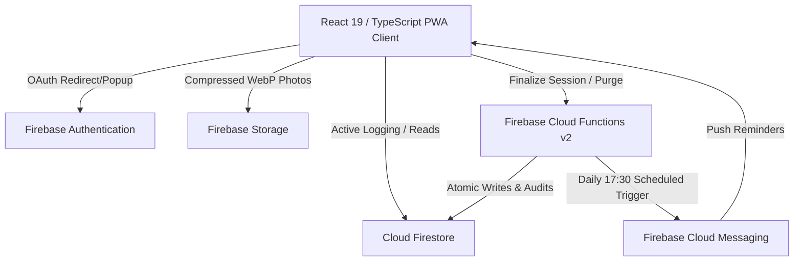

# ARCHIMEDES — Architecture Specification

## 1. System Overview

ARCHIMEDES is structured as a client-first, cloud-persisted Progressive Web Application (PWA) with server-authoritative progression controls. The system strictly separates transient client UI interactions from authoritative data persistence.



---

## 2. Frontend Architecture

### 2.1 Framework & Runtime
- **React 19 & TypeScript 5.7**: Strict type enforcement across all data models, progression formulas, and workout definitions.
- **Vite 6**: Fast development server and production Rollup bundler with manual chunk splitting.

### 2.2 Routing & Navigation
- **Lightweight Single-Page Navigation**:
  - Direct URL mapping using browser History API (`window.history.pushState` and `popstate` listeners) without the heavy bundle overhead of generic router packages.
  - Primary routes:
    - `/`: Landing or auto-redirect
    - `/login`: Unauthenticated landing screen
    - `/onboarding`: Mandatory Day 1 baseline and progress photo setup
    - `/system`: Operational instrument panel, current mission, and status
    - `/quest`: Active workout engine, set logger, and rest timer
    - `/stats`: Diagnostic scan, PR archive, exercise logs, achievements, and bosses
    - `/progress`: Body metrics, benchmark lift evolution, photo timeline, and calendar
    - `/profile`: Operator credentials, cosmetic title equips, reward vault, and account actions
- **Route-Level Code Splitting**:
  - `StatsScreen`, `ProgressScreen`, and `ProfileScreen` are dynamically imported via `React.lazy()` and wrapped in `Suspense` boundaries, reducing the initial load chunk down to ~92 kB gzip.

### 2.3 State Management & React Contexts
- **`AuthContext` (`src/context/AuthContext.tsx`)**:
  - Manages Firebase `User` lifecycle and subscription to `users/{uid}` in Firestore.
  - Tracks browser network connectivity (`navigator.onLine`, `online` / `offline` events) to display the connection warning banner.
  - Coordinates global account deletion across Firestore and Storage.
- **`UserProgressionContext` (`src/context/UserProgressionContext.tsx`)**:
  - Coordinates the active workout session in Firestore (`users/{uid}/activeSessions/{dateKey}`).
  - Maintains the silent, timestamp-based Rest Timer.
  - Drives challenge day navigation (Day 1 to 120) with default selection pegged to Kolkata local time.
  - Handles authoritative workout finalization and triggers sequential XP and Level-up modal animations.

### 2.4 Styling & Design System
- **Pure Vanilla CSS (`src/index.css`)**:
  - No Tailwind CSS, no CSS-in-JS runtimes, no external UI component kits.
  - Monochromatic CSS custom properties:
    - Backgrounds: `--bg-primary` (`#000000`), `--bg-surface` (`#121212`), `--bg-inverted` (`#ffffff`)
    - Text: `--text-primary` (`#ffffff`), `--text-secondary` (`rgba(255,255,255,0.7)`), `--text-muted` (`rgba(255,255,255,0.4)`), `--text-inverted` (`#000000`)
    - Borders: `--border-strong` (`#ffffff`), `--border-medium` (`rgba(255,255,255,0.35)`), `--border-subtle` (`rgba(255,255,255,0.15)`)
  - Strict compliance with `prefers-reduced-motion` and user-configurable `reducedMotion` settings.

---

## 3. Backend Architecture

### 3.1 Firebase Authentication
- Restricted to **Google OAuth provider** only.
- Mobile browser safe flow: initiates redirect on mobile viewports and popup on desktop environments.
- Returns authenticated `uid` that strictly scopes all database reads, writes, and storage paths.

### 3.2 Cloud Firestore
- Document and subcollection architecture isolating all user records under `users/{uid}`.
- Immutable finalized sessions prevent client-side record tampering.
- Active workout sessions allow real-time resumption across browser refreshes or backgrounding.

### 3.3 Firebase Storage
- Private, authenticated storage bucket paths:
  ```text
  users/{uid}/progress/{checkpointId}/{photoType}.webp
  ```
- Public URLs are never generated. Access is gated by client-side authenticated Storage tokens.

### 3.4 Firebase Cloud Functions (v2)
- Deployed in the `asia-south1` (Mumbai) region for minimal latency to the target user in India (`Asia/Kolkata` timezone).
- **`finalizeSession` (Callable)**: Validates authentication, enforces idempotency, calculates progression, detects PRs, and updates Firestore atomically via `WriteBatch`.
- **`scheduledTrainingReminder` (Scheduler)**: Daily 17:30 IST cron job checking uncompleted sessions and sending FCM notifications.
- **`deleteUserData` (Callable)**: Performs authoritative account and storage file purge.

---

## 4. End-to-End Data Flows

### 4.1 Authentication & Profile Hydration Flow
```text
1. User clicks [ CONTINUE WITH GOOGLE ]
2. Firebase Auth performs Google OAuth
3. onAuthStateChanged triggers in AuthContext
4. AuthContext checks Firestore users/{uid}
   ├─ If document exists: Hydrate UserProfile in state
   └─ If not found: Generate default Day 1 UserProfile -> Save to Firestore -> Enter Onboarding
```

### 4.2 Active Workout Logging Flow
```text
1. User opens Quest screen (/quest)
2. UserProgressionContext subscribes to users/{uid}/activeSessions/{dateKey}
3. Operator enters load (kg) & reps -> Taps [ COMPLETE SET ]
4. Set appended to active session -> Persisted online to Firestore
5. Silent Rest Timer activates (3 min timestamp target)
6. If browser reloads or Android kills tab, session resumes immediately from Firestore
```

### 4.3 Session Finalization Flow
```text
1. User completes training -> Taps [ FINALIZE WORKOUT SESSION ]
2. System checks network connectivity:
   ├─ If offline: Halt execution with [ CONNECTION REQUIRED ] alert
   └─ If online: Invoke finalizeWorkoutSession service
3. finalizeWorkoutSession attempts Cloud Function execution (with local authoritative fallback):
   ├─ Verify caller UID == session UID
   ├─ Validate idempotency (ensure session_{dateKey} not already finalized)
   ├─ Calculate base XP (Full, Reduced 60%, or Minimum Viable 75 XP)
   ├─ Evaluate exercise PRs (Weight, Rep, Volume, Duration, Assistance; capped at 150 XP)
   ├─ Verify Boss Quest completion against logged set metrics
   ├─ Apply Streak milestones & Attribute gains
   ├─ Calculate new Level threshold & System Power score
   └─ Execute atomic Firestore commit:
        • Write immutable session to users/{uid}/sessions/{sessionId}
        • Update user progression in users/{uid}
        • Save historical exercise records in users/{uid}/exerciseRecords
        • Delete active session in users/{uid}/activeSessions/{dateKey}
        • Append audit log to users/{uid}/events
4. UI displays sequential XP reveal animation followed by Level-up overlay if applicable
```

---

## 5. Performance & Mobile Engineering (OPPO A54 Target)

The application has been engineered to run smoothly on low-end Android hardware (OPPO A54, MediaTek Helio P35, 4GB RAM):

1. **Minimal DOM Depth**: Section-based vertical mobile layout instead of complex card meshes and heavy nested flex containers.
2. **Zero Continuous Animation Loops**: All transitions are event-driven CSS transitions triggered by user interaction; idle CPU usage is 0%.
3. **No Canvas or Heavy SVG Graphics**: No Three.js, WebGL, or Canvas rendering in the UI. Visual flair is achieved with pure typography, 1px borders, and solid block inversions.
4. **Client-Side Image Compression & EXIF Stripping**:
   - High-resolution camera photos (often 5–15 MB with EXIF metadata) are drawn onto an offscreen HTML5 canvas.
   - Resized to a maximum bounding box of 1080×1440, stripped of metadata, and converted to WebP at 0.82 quality.
   - Reduces upload payload to ~80–140 kB, eliminating out-of-memory errors on older Android devices.
5. **Route-Level Code Splitting**:
   - Secondary tabs (`Stats`, `Progress`, `Profile`) are separated into standalone asynchronous bundles.
   - Initial JavaScript download on first paint is minimized.

---

## 6. Directory Structure

```text
src/
├── App.tsx                        # Master router, navigation controller, and modal host
├── index.css                      # Monochrome design system and responsive tokens
├── main.tsx                       # React root entry point
├── vite-env.d.ts                  # Typed environment variables
├── components/
│   ├── common/                    # Button, InstallPrompt, Modal, ProgressBar, RankBadge, RestTimer
│   ├── layout/                    # AppShell, BottomNav, OfflineBanner, SystemHeader
│   └── overlays/                  # ExceptionModal, LevelUpOverlay, MissionMissedModal, XPRevealOverlay
├── context/
│   ├── AuthContext.tsx            # Authentication, profile listener, and online state
│   └── UserProgressionContext.tsx # Active session sync, rest timer, and workout finalization
├── data/
│   ├── achievements.ts            # System achievement definitions
│   ├── baseline.ts                # Day 1 baseline constants and factory
│   ├── bosses.ts                  # Boss quest definitions
│   ├── titles.ts                  # Cosmetic titles & unlock levels
│   └── workoutSchedule.ts         # Full 7-day workout schedule definitions
├── features/
│   ├── auth/                      # LoginScreen, OnboardingScreen
│   ├── profile/                   # ProfileScreen, RewardVaultView
│   ├── progress/                  # ProgressScreen, CalendarGrid, PhotoTimeline
│   ├── quest/                     # QuestScreen, ExerciseLogger, BlockChecklist
│   ├── stats/                     # StatsScreen, SystemScan, PRArchive, HistoryView
│   └── system/                    # SystemScreen, SystemEventsFeed
├── lib/
│   ├── compression/               # imageCompressor.ts
│   ├── dates/                     # challengeDates.ts
│   ├── firebase/                  # auth.ts, config.ts, db.ts, functions.ts, messaging.ts, storage.ts
│   ├── formatting/                # formatters.ts
│   └── progression/               # Mathematical algorithms for XP, levels, PRs, and power
└── tests/
    └── archimedes.test.ts         # Automated Vitest test suite
```
